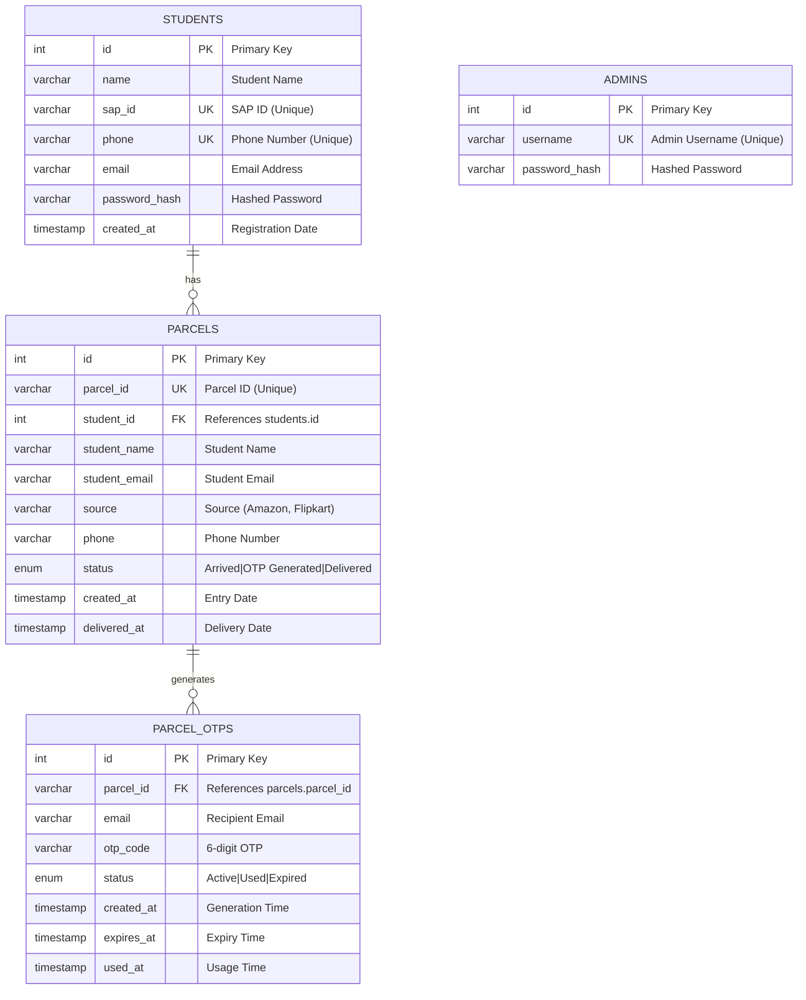
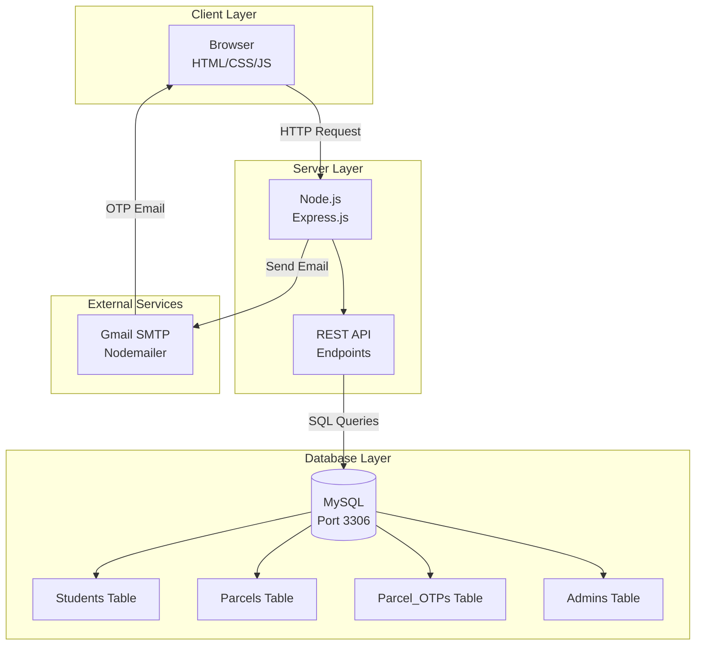
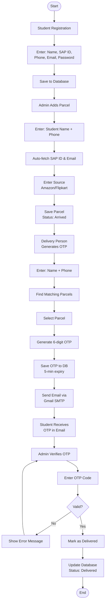
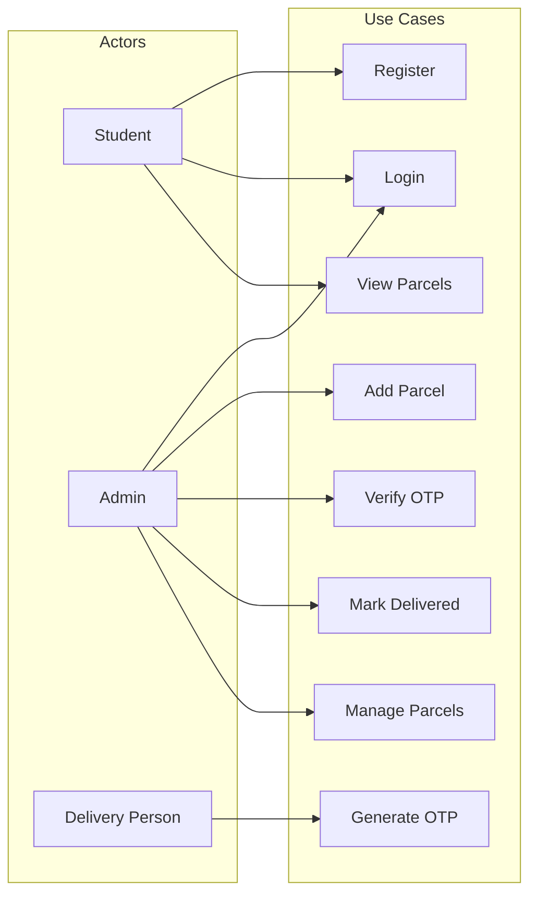
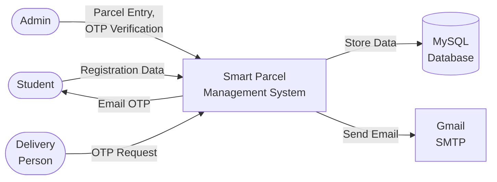

# Smart Parcel Management System
## Complete Project Documentation

---

## 1. PROBLEM STATEMENT

### 1.1 Current Challenges in Parcel Management
- **Manual Tracking**: Educational institutions still use paper-based or spreadsheet systems to track parcel arrivals and deliveries
- **Security Concerns**: No verification system for parcel handover, leading to potential misplacement or unauthorized collection
- **Communication Gap**: Students are not notified promptly when parcels arrive
- **Inefficient Process**: Administrative staff spend excessive time managing parcel records manually
- **No Audit Trail**: No digital record of who received which parcel and when

### 1.2 Specific Problems Addressed
1. **Lack of Real-time Notifications**: Students don't know when their parcels have arrived
2. **Identity Verification**: No secure method to verify parcel recipient identity
3. **Data Management**: Difficulty in maintaining and searching parcel records
4. **Multi-user Access**: No role-based system for different users (Admin, Student, Delivery Person)
5. **Parcel Tracking**: No unique identification system for parcels

---

## 2. PROPOSED SOLUTION

### 2.1 System Overview
The Smart Parcel Management System is a full-stack web application that digitizes the entire parcel management process for educational institutions. It provides:

- **Role-based access control** (Admin, Student, Delivery Person)
- **Email-based OTP verification** for secure parcel handover
- **Real-time database** for instant record updates
- **Automated notifications** via email
- **Search and filter capabilities** for parcel tracking

### 2.2 Key Features

#### 2.2.1 User Management
| Role | Capabilities |
|------|-------------|
| **Admin** | Add parcels, verify OTP, mark deliveries, view all records |
| **Student** | Register, view own parcels, receive OTP via email |
| **Delivery Person** | Generate OTP for parcel handover (no login required) |

#### 2.2.2 Core Functionalities
1. **Student Registration** with email, phone, and SAP ID
2. **Parcel Entry** by Admin with auto-fetched student details
3. **OTP Generation** by Delivery Person using Name + Phone lookup
4. **Email Notification** with OTP to student's registered email
5. **OTP Verification** by Admin during parcel handover
6. **Status Tracking** (Arrived → OTP Generated → Delivered)

---

## 3. SYSTEM ARCHITECTURE

### 3.1 Technology Stack

```
┌─────────────────────────────────────────────────────────────┐
│                    FRONTEND LAYER                          │
│  HTML5 | CSS3 | JavaScript (ES6+) | Responsive Design      │
└─────────────────────────────────────────────────────────────┘
                            │
                            ▼
┌─────────────────────────────────────────────────────────────┐
│                    BACKEND LAYER                           │
│  Node.js | Express.js | RESTful APIs | CORS Enabled        │
└─────────────────────────────────────────────────────────────┘
                            │
                            ▼
┌─────────────────────────────────────────────────────────────┐
│                    DATABASE LAYER                          │
│  MySQL (via MySQL Workbench) | mysql2 | Port 3306          │
└─────────────────────────────────────────────────────────────┘
                            │
                            ▼
┌─────────────────────────────────────────────────────────────┐
│                 EXTERNAL SERVICES                          │
│  Gmail SMTP | Nodemailer | App Password Authentication     │
└─────────────────────────────────────────────────────────────┘
```

### 3.2 Entity Relationship (ER) Diagram

#### ASCII Diagram:
```
┌─────────────────────────────────────────────────────────────────────────┐
│                         ER DIAGRAM                                       │
└─────────────────────────────────────────────────────────────────────────┘

    ┌─────────────────┐         ┌─────────────────┐         ┌─────────────────┐
    │    STUDENTS     │         │    PARCELS      │         │  PARCEL_OTPS    │
    ├─────────────────┤         ├─────────────────┤         ├─────────────────┤
    │ PK id           │◄────────│ FK student_id   │         │ PK id           │
    │    name         │    1:M  │    parcel_id    │◄────────│ FK parcel_id    │
    │    sap_id (UQ)  │         │    student_name │    1:M  │    email        │
    │    phone (UQ)   │         │    student_email│         │    otp_code     │
    │    email        │         │    source       │         │    status       │
    │    password_hash│         │    phone        │         │    created_at   │
    │    created_at   │         │    status       │         │    expires_at   │
    └─────────────────┘         │    created_at   │         │    used_at      │
                                │    delivered_at │         └─────────────────┘
                                └─────────────────┘
                                         │
                                         │
                                         ▼
                                ┌─────────────────┐
                                │     ADMINS      │
                                ├─────────────────┤
                                │ PK id           │
                                │    username(UQ) │
                                │    password_hash│
                                └─────────────────┘
```

#### Mermaid Code (Copy to generate image):


**To generate image:**
1. Go to https://mermaid.live
2. Paste the Mermaid code above
3. Download as PNG/SVG

---

### 3.3 System Architecture Diagram

#### Mermaid Code:


---

### 3.4 Complete Workflow Diagram

#### Mermaid Code:


---

### 3.5 Use Case Diagram

#### Mermaid Code:


---

### 3.6 Data Flow Diagram (Level 0)

#### Mermaid Code:


### 3.3 Database Schema

```sql
-- Students Table
CREATE TABLE students (
    id INT AUTO_INCREMENT PRIMARY KEY,
    name VARCHAR(100) NOT NULL,
    sap_id VARCHAR(20) UNIQUE NOT NULL,
    phone VARCHAR(15) UNIQUE NOT NULL,
    email VARCHAR(100) NOT NULL,
    password_hash VARCHAR(255) NOT NULL,
    created_at TIMESTAMP DEFAULT CURRENT_TIMESTAMP
);

-- Parcels Table
CREATE TABLE parcels (
    id INT AUTO_INCREMENT PRIMARY KEY,
    parcel_id VARCHAR(20) UNIQUE NOT NULL,
    student_id INT NOT NULL,
    student_name VARCHAR(100) NOT NULL,
    student_email VARCHAR(100) NOT NULL,
    source VARCHAR(100) NOT NULL,
    phone VARCHAR(15) NOT NULL,
    status ENUM('Arrived', 'OTP Generated', 'Delivered') DEFAULT 'Arrived',
    created_at TIMESTAMP DEFAULT CURRENT_TIMESTAMP,
    delivered_at TIMESTAMP NULL,
    FOREIGN KEY (student_id) REFERENCES students(id)
);

-- Parcel OTPs Table
CREATE TABLE parcel_otps (
    id INT AUTO_INCREMENT PRIMARY KEY,
    parcel_id VARCHAR(20) NOT NULL,
    email VARCHAR(100) NOT NULL,
    otp_code VARCHAR(6) NOT NULL,
    status ENUM('Active', 'Used', 'Expired') DEFAULT 'Active',
    created_at TIMESTAMP DEFAULT CURRENT_TIMESTAMP,
    expires_at TIMESTAMP NOT NULL,
    used_at TIMESTAMP NULL
);

-- Admins Table
CREATE TABLE admins (
    id INT AUTO_INCREMENT PRIMARY KEY,
    username VARCHAR(50) UNIQUE NOT NULL,
    password_hash VARCHAR(255) NOT NULL
);
```

---

## 4. WORKFLOW DIAGRAMS

### 4.1 Complete System Workflow

```
┌──────────────┐
│   START      │
└──────┬───────┘
       │
       ▼
┌─────────────────────────────────────────────────────────────┐
│  STUDENT REGISTRATION                                       │
│  ┌─────────────┐    ┌─────────────┐    ┌─────────────┐     │
│  │ Enter Name  │───▶│ Enter Phone │───▶│ Enter Email │     │
│  └─────────────┘    └─────────────┘    └─────────────┘     │
│       │                                        │             │
│       ▼                                        ▼             │
│  ┌─────────────┐    ┌─────────────┐    ┌─────────────┐     │
│  │ Enter SAP ID│───▶│ Set Password│───▶│  Submit     │     │
│  └─────────────┘    └─────────────┘    └─────────────┘     │
└─────────────────────────────────────────────────────────────┘
       │
       ▼
┌─────────────────────────────────────────────────────────────┐
│  ADMIN ADDS PARCEL                                          │
│  ┌─────────────┐    ┌─────────────┐    ┌─────────────┐     │
│  │Enter Student│───▶│Enter Phone  │───▶│Fetch Details│     │
│  │   Name      │    │   Number    │    │(Auto-fill)  │     │
│  └─────────────┘    └─────────────┘    └─────────────┘     │
│       │                                        │             │
│       ▼                                        ▼             │
│  ┌─────────────┐    ┌─────────────┐    ┌─────────────┐     │
│  │Enter Source │───▶│  Submit     │───▶│Save to DB   │     │
│  │  (Amazon,   │    │             │    │Status:Arrived│    │
│  │  Flipkart)  │    │             │    │             │     │
│  └─────────────┘    └─────────────┘    └─────────────┘     │
└─────────────────────────────────────────────────────────────┘
       │
       ▼
┌─────────────────────────────────────────────────────────────┐
│  OTP GENERATION (Delivery Person)                           │
│  ┌─────────────┐    ┌─────────────┐    ┌─────────────┐     │
│  │Enter Student│───▶│Enter Phone  │───▶│Find Parcels │     │
│  │   Name      │    │   Number    │    │             │     │
│  └─────────────┘    └─────────────┘    └─────────────┘     │
│       │                                        │             │
│       ▼                                        ▼             │
│  ┌─────────────┐    ┌─────────────┐    ┌─────────────┐     │
│  │Select Parcel│───▶│Generate OTP │───▶│Send Email   │     │
│  │  from List  │    │             │    │with OTP     │     │
│  └─────────────┘    └─────────────┘    └─────────────┘     │
└─────────────────────────────────────────────────────────────┘
       │
       ▼
┌─────────────────────────────────────────────────────────────┐
│  PARCEL HANDOVER (Admin)                                    │
│  ┌─────────────┐    ┌─────────────┐    ┌─────────────┐     │
│  │View Parcel  │───▶│Enter OTP    │───▶│Verify OTP   │     │
│  │  List       │    │             │    │             │     │
│  └─────────────┘    └─────────────┘    └─────────────┘     │
│       │                                        │             │
│       │         ┌─────────┐                   │             │
│       │    No   │Valid?   │                   │ Yes         │
│       │◀────────│         │◀──────────────────┤             │
│       │         └─────────┘                   │             │
│       │                                        ▼             │
│       │                              ┌─────────────┐        │
│       │                              │Mark Delivered│       │
│       │                              │Update Status │       │
│       │                              └─────────────┘        │
│       ▼                                                    │
│  ┌─────────────┐                                           │
│  │ Show Error  │                                           │
│  └─────────────┘                                           │
└─────────────────────────────────────────────────────────────┘
       │
       ▼
┌──────────────┐
│    END       │
└──────────────┘
```

### 4.2 Database Interaction Flow

```
┌──────────────┐     HTTP Request      ┌──────────────┐
│   Frontend   │──────────────────────▶│   Node.js    │
│   (Browser)  │◀──────────────────────│   Backend    │
└──────────────┘     JSON Response     └──────┬───────┘
                                              │
                                              │ SQL Query
                                              ▼
                                       ┌──────────────┐
                                       │    MySQL     │
                                       │  Database    │
                                       │   (Port      │
                                       │    3306)     │
                                       └──────────────┘
```

### 4.3 Email OTP Flow

```
┌──────────────┐
│ Delivery     │
│ Person       │
│ Enters Info  │
└──────┬───────┘
       │
       ▼
┌──────────────┐
│ Backend      │
│ Generates    │
│ 6-digit OTP  │
└──────┬───────┘
       │
       ▼
┌──────────────┐
│ Save OTP to  │
│ Database     │
│ (5 min expiry)│
└──────┬───────┘
       │
       ▼
┌──────────────┐
│ Nodemailer   │
│ Sends Email  │
│ via Gmail    │
└──────┬───────┘
       │
       ▼
┌──────────────┐
│ Student      │
│ Receives OTP │
│ in Email     │
└──────────────┘
```

---

## 5. API ENDPOINTS

### 5.1 Authentication APIs
| Endpoint | Method | Description |
|----------|--------|-------------|
| `/api/student/register` | POST | Register new student |
| `/api/student/login` | POST | Student login |
| `/api/admin/login` | POST | Admin login |

### 5.2 Student APIs
| Endpoint | Method | Description |
|----------|--------|-------------|
| `/api/students/search` | GET | Search student by name+phone |
| `/api/student/parcels` | GET | Get student's parcels |

### 5.3 Parcel APIs
| Endpoint | Method | Description |
|----------|--------|-------------|
| `/api/parcels` | POST | Create new parcel |
| `/api/parcels/all` | GET | Get all parcels |
| `/api/parcels/by-student` | GET | Get parcels by student |
| `/api/parcels/search` | GET | Search parcels |

### 5.4 OTP APIs
| Endpoint | Method | Description |
|----------|--------|-------------|
| `/api/otp/generate` | POST | Generate and send OTP |
| `/api/otp/verify` | POST | Verify OTP and mark delivered |

---

## 6. USER INTERFACE SCREENS

### 6.1 Role Selection Page
- Three options: Student, Admin, Delivery Person
- Red and white theme consistent across all pages

### 6.2 Student Portal
- **Registration**: Name, SAP ID, Phone, Email, Password
- **Login**: SAP ID and Password
- **Dashboard**: View personal parcels with status

### 6.3 Admin Portal
- **Login**: Username (nmims@123) and Password (nmims123)
- **Dashboard**: Statistics (Total, Arrived, Delivered)
- **Add Parcel**: Auto-fetch student details by Name+Phone
- **Manage Parcels**: View all, search, verify OTP, mark delivered

### 6.4 Delivery Person Portal
- **No login required**
- **Generate OTP**: Enter student Name+Phone → Find Parcels → Select → Generate OTP
- **OTP Display**: Shows generated OTP and confirms email sent

---

## 7. SECURITY FEATURES

### 7.1 Password Security
- bcrypt hashing with salt rounds
- Minimum 6 characters for student passwords

### 7.2 OTP Security
- 6-digit random OTP
- 5-minute expiry time
- One-time use only
- Email delivery to verified address

### 7.3 Input Validation
- SAP ID: 11 digits
- Phone: 10 digits
- Email: Valid format required
- All fields mandatory

---

## 8. CONFIGURATION

### 8.1 Environment Variables (.env)
```
# Database Configuration
DB_HOST=localhost
DB_PORT=3306
DB_USER=root
DB_PASSWORD=karnika@1307
DB_NAME=parcel_management

# Server Port
PORT=3000

# Email Configuration
EMAIL_USER=project.demo1307@gmail.com
EMAIL_PASS=rulyjbkfyfaldrly
```

### 8.2 Prerequisites
- Node.js 18+
- MySQL (MySQL Workbench or XAMPP)
- Gmail account with App Password

---

## 9. INSTALLATION STEPS

1. **Clone Repository**
   ```bash
   git clone https://github.com/karnikagupta1307-boop/my-first-project.git
   cd my-first-project
   ```

2. **Install Dependencies**
   ```bash
   npm install
   ```

3. **Configure Environment**
   - Create `.env` file
   - Add database and email credentials

4. **Start MySQL Server**
   - Ensure MySQL is running on port 3306

5. **Start Application**
   ```bash
   node server.js
   ```

6. **Access Application**
   - Open browser: `http://localhost:3000`

---

## 10. DEMONSTRATION SCRIPT

### 10.1 For Faculty Presentation

**Step 1: Show Database Connection**
- Open MySQL Workbench
- Show `parcel_management` database
- Show tables: students, parcels, parcel_otps

**Step 2: Start Application**
- Run `node server.js`
- Show terminal: "Successfully connected to MySQL database!"

**Step 3: Student Registration**
- Open browser → `http://localhost:3000`
- Register new student with email
- Show data in MySQL Workbench

**Step 4: Admin Adds Parcel**
- Login as Admin (nmims@123 / nmims123)
- Add parcel for registered student
- Show auto-fetch of SAP ID and Email
- Show parcel in database

**Step 5: Generate OTP**
- Go to Generate OTP page (no login)
- Enter student name and phone
- Select parcel and generate OTP
- Show OTP email received

**Step 6: Verify OTP**
- Admin opens Manage Parcels
- Enter OTP and verify
- Show status change to "Delivered"
- Show updated database record

---

## 11. FUTURE ENHANCEMENTS

1. **SMS Notifications**: Add Twilio for SMS OTP
2. **QR Code**: Generate QR codes for quick parcel identification
3. **Mobile App**: React Native or Flutter app
4. **Analytics Dashboard**: Charts for parcel statistics
5. **Multi-language Support**: Hindi, Marathi, etc.
6. **Barcode Scanner**: Integration for parcel entry

---

## 12. TROUBLESHOOTING

| Issue | Solution |
|-------|----------|
| Port 3306 in use | Stop other MySQL services |
| Email not sending | Check Gmail App Password |
| Database connection error | Verify DB_PASSWORD in .env |
| OTP not received | Check spam folder |

---

## 13. CONCLUSION

The Smart Parcel Management System successfully digitizes the parcel management process with:
- ✅ Secure OTP-based verification
- ✅ Real-time database updates
- ✅ Email notifications
- ✅ Role-based access control
- ✅ Responsive web interface

The system is production-ready and can be deployed in educational institutions.

---

**Project Repository**: https://github.com/karnikagupta1307-boop/my-first-project

**Developed By**: Karnika Gupta
**Institution**: NMIMS
**Year**: 2024-2025
